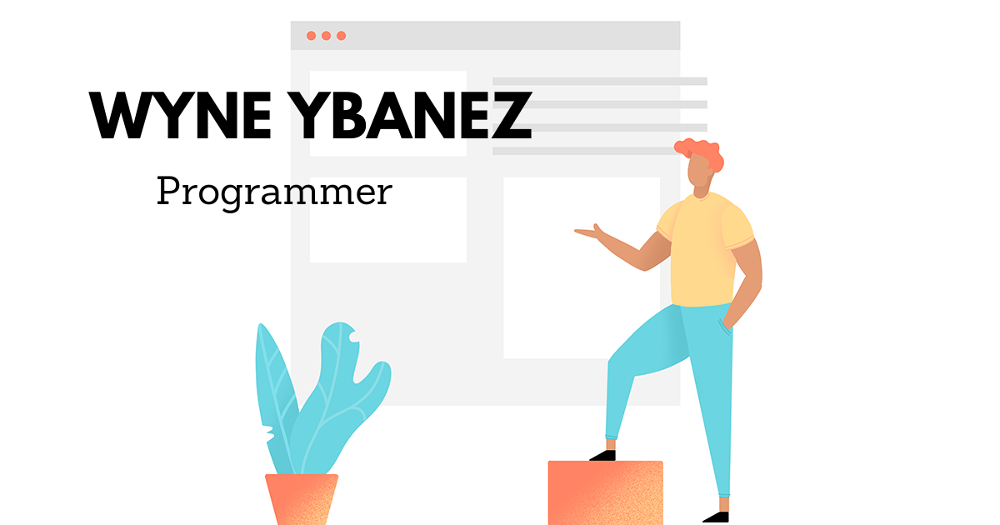

## Hi there - My name is Wyne 👋 

### About Me 👨‍💻

I am a Software Developer in the making. I am also working as a Customer Service Associate at Amazon on a part-time basis so that I may continue to pursue my education in Software Development. Ideally, I am coding so that I may obtain career in the tech industry.

### What I'm doing now 📚

Here are the following coding languages and frameworks that I am skilled at.

#### Front-End:

- HTML5
- CSS3
- Bootstrap
- TailwindCSS / MaterializeCSS
- JavaScript 
- Vue.js
- Jquery
- REST API
- Ajax/Fetch/Axios

#### Back-End:

- Python
- Django
- Flask
- MongoDB
- SQL

For the validation of this bootcamp. The bootcamp awards a University Creditted Diploma in Software Development. This is association with Edinburgh Napier University. 

### Projects 💻 

- #### [Personal Portfolio Project](https://wyne-ybanez.github.io/personal-portfolio-master/)
  Github Repo: https://github.com/wyne-ybanez/personal-portfolio-master

- #### [Front-End Interactive Project - Self-driving taxi service](https://wyne-ybanez.github.io/self-driving-car-delivery/)
  Github Repo: https://github.com/wyne-ybanez/self-driving-car-delivery

- #### [Data-Centric Project - 'Papercuts'](https://papercuts-project.herokuapp.com/)
  Github Repo: https://github.com/wyne-ybanez/PaperCut

### Group Projects 🤝 

- #### [St. Patrick's day quiz](https://wyne-ybanez.github.io/st.patricks-postcard/)
  Github Repo: https://github.com/wyne-ybanez/st.patricks-postcard

### Collaboration, Contacting me...👯 

I am extremely enthusiastic to help with any project. 
If you think I am a worthy candidate for your project or if you have any queries.
Please feel free to reach out to me. 

Here is the link to my LinkedIn: https://www.linkedin.com/in/wyne-ybanez-8a2763193

<!--
**wyne-ybanez/wyne-ybanez** is a ✨ _special_ ✨ repository because its `README.md` (this file) appears on your GitHub profile.

Here are some ideas to get you started:

- 🔭 I’m currently working on ...
- 🌱 I’m currently learning ...
- 👯 I’m looking to collaborate on ...
- 🤔 I’m looking for help with ...
- 💬 Ask me about ...
- 📫 How to reach me: ...
- 😄 Pronouns: ...
- ⚡ Fun fact: ...
-->
