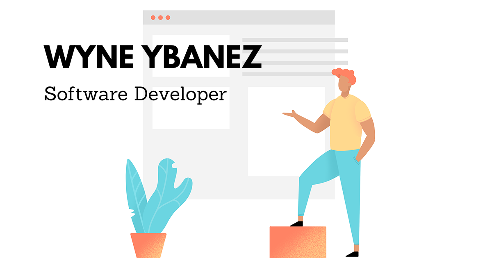

## Hi there - My name is Wyne 👋 

### About Me 👨‍💻

I am currently attending a coding bootcamp called 'Code Institute'. I am also working as a Customer Service Associate at Amazon on a part-time basis so that I may continue to pursue my education in Software Development. Ideally, I am a junior software developer.

At the same time I am looking to pursue a Software Development Apprenticeship in Ireland with FIT (Fast Track into Technology)

### What I'm doing now 📚

Learning a lot from Youtube, Stack Overflow, FreeCodeCamp and CodeInstitute!

Here are the following coding languages and frameworks that I am learning for Front-End:

- HTML5
- CSS3
- Bootstrap
- JavaScript 
- TailWind CSS
- Jasmine Testing
- Sass

Languages I will be learning for Back-End:

- Python
- Django
- Flask
- mySQL

I am currently building projects to improve my skills. These milestone projects will be placed in my personal website. Any honourable project mentions will also be added there. 

For the validation of this bootcamp. The bootcamp awards a University Creditted Diploma in Software Development. This is association with Edinburgh Napier University. 

### Projects 💻 

- Milestone 1 - Here is the link to my Personal Portfolio Website: https://wyne-ybanez.github.io/personal-portfolio-master/

(More projects will be added in the near future)

### Collaboration, Contacting me...👯 

I am extremely enthusiastic to help with any project. 
If you think I am a worthy candidate for your project or if you have any queries.
Please feel free to reach out to me. 

Here is the link to my LinkedIn: https://www.linkedin.com/in/wyne-ybanez-8a2763193

<!--
**wyne-ybanez/wyne-ybanez** is a ✨ _special_ ✨ repository because its `README.md` (this file) appears on your GitHub profile.

Here are some ideas to get you started:

- 🔭 I’m currently working on ...
- 🌱 I’m currently learning ...
- 👯 I’m looking to collaborate on ...
- 🤔 I’m looking for help with ...
- 💬 Ask me about ...
- 📫 How to reach me: ...
- 😄 Pronouns: ...
- ⚡ Fun fact: ...
-->
